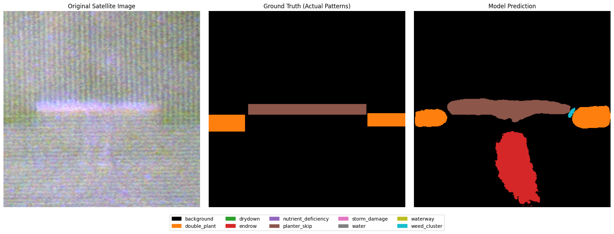
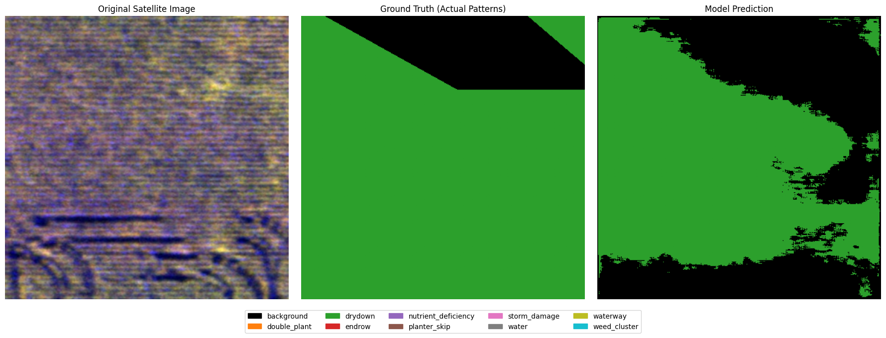
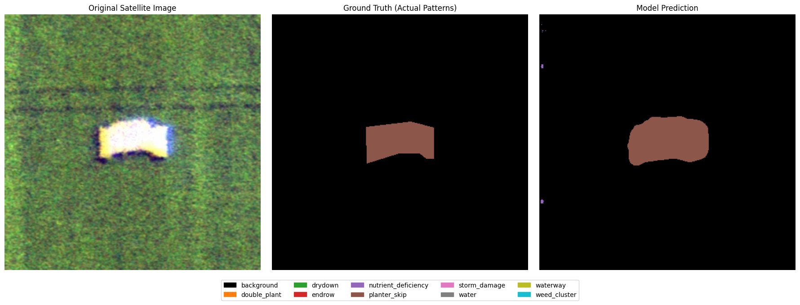

# Farmland Anomaly Detection via Multispectral Semantic Segmentation

This repository presents a deep learning-based framework for automated detection and pixel-level classification of farmland anomalies from aerial imagery. The work is designed to support precision agriculture by identifying agronomically important patterns such as weed clusters, waterlogging, nutrient deficiency, planter skips, and other field irregularities from high-resolution remote sensing data.

The proposed approach combines visible RGB information with near-infrared (NIR) reflectance to form a four-channel input representation and employs a semantic segmentation model to generate dense anomaly maps over agricultural fields.

## Overview

Modern agriculture increasingly relies on data-driven monitoring systems to identify field stress, crop irregularities, and management issues at scale. Manual scouting is expensive, time-consuming, and often incomplete. This project addresses that challenge by introducing an automated segmentation pipeline that transforms aerial imagery into actionable spatial maps of anomalies.

Our method is built around the following principles:

- Multispectral fusion of RGB and NIR imagery for improved scene understanding
- Pixel-wise semantic segmentation rather than coarse image classification
- Explicit handling of rare and visually subtle agricultural anomalies
- Robust training strategies for class imbalance and annotation complexity

## Problem Statement

Agricultural fields often contain localized anomalies that are difficult to detect reliably from visual inspection alone. These anomalies may indicate:

- Weed infestation
- Water-related damage or poor drainage
- Nutrient deficiency
- Planting irregularities
- Structural field abnormalities such as endrows and waterways

Accurate and early identification of such patterns is essential for targeted intervention, efficient resource allocation, and improved crop health management.

## Dataset

The project uses the Agriculture-Vision dataset, a large-scale aerial image collection tailored for agricultural pattern recognition. Each sample contains:

- RGB imagery
- NIR imagery
- Boundary and validity masks
- Multi-class annotations for agricultural anomalies

The dataset is organized into training and validation splits, and the annotation schema covers multiple anomaly classes, including:

- Double plant
- Drydown
- Endrow
- Nutrient deficiency
- Planter skip
- Storm damage
- Water
- Waterway
- Weed cluster

## Proposed Methodology

### 1. Multispectral Input Representation

The model receives a four-channel tensor formed by concatenating:

- Red, Green, and Blue channels from RGB imagery
- A grayscale NIR channel

This multispectral representation improves discrimination between vegetation stress, moisture, and background conditions that are often ambiguous in RGB-only analysis.

### 2. Semantic Segmentation Architecture

A U-Net-style segmentation network with an EfficientNet-B3 encoder is used as the backbone. The encoder is initialized with pretrained ImageNet weights, and the first convolutional layer is adapted from three input channels to four to accommodate the RGB-NIR input tensor.

This architecture is well suited to dense prediction tasks because it combines:

- Hierarchical feature extraction
- Multi-scale contextual information
- High-resolution spatial reconstruction through decoder pathways

### 3. Training Strategy

Several design choices are incorporated to improve learning quality and generalization:

- Randomized augmentations, including crop, flip, rotation, brightness adjustment, and noise injection
- Stratified validation splitting with rare-class samples explicitly preserved in validation
- Class-weighted sampling to mitigate imbalance across anomaly categories
- A composite loss function combining cross-entropy and Dice loss to optimize both pixel-wise correctness and region-level overlap
- Mixed-precision training for computational efficiency

### 4. Evaluation and Inference

Model performance is assessed using a confusion-matrix-based evaluation pipeline and mean Intersection over Union (mIoU). During inference, test-time augmentation is applied to improve prediction stability, and output masks are saved as segmentation maps for downstream analysis.

## Technical Highlights

- End-to-end training pipeline for semantic segmentation of agricultural anomalies
- Support for RGB-NIR multimodal fusion
- Explicit treatment of rare anomaly categories
- Validation-ready checkpointing and prediction export
- Reproducible experiment workflow implemented in the notebook

## Repository Contents

- [Untitled8.ipynb](Untitled8.ipynb): End-to-end experiment notebook containing data preparation, dataset construction, training, validation, and inference
- [best.pth](best.pth): Trained model checkpoint
- [val_predictions.zip](val_predictions.zip): Validation predictions exported in compressed form
- [result1.png](result1.png), [result2.png](result2.png), [result3.png](result3.png): Representative qualitative segmentation outputs

## Representative Results

The following examples illustrate the qualitative performance of the proposed approach on representative agricultural scenes.







## Getting Started

### Environment Setup

Install the required dependencies:

```bash
pip install -q huggingface_hub segmentation-models-pytorch albumentations tqdm
```

### Dataset Preparation

The notebook downloads the Agriculture-Vision dataset directly from Hugging Face Hub and prepares the train and validation directories for training.

### Training

Run the training cells in [Untitled8.ipynb](Untitled8.ipynb) to:

1. Build the dataset loaders
2. Train the segmentation model
3. Evaluate on validation data
4. Save the best checkpoint

### Inference

The notebook also includes inference routines for generating segmentation masks and exporting predictions as compressed archives.

## Notes for Reproducibility

- The implementation is designed to be executed in a GPU-enabled environment for efficient training.
- The current repository includes a trained checkpoint and exported validation predictions for immediate inspection.
- The workflow is modular and can be extended to additional anomaly classes or larger-scale deployment scenarios.

## Acknowledgements

This work draws on the Agriculture-Vision benchmark and related open-source deep learning libraries for segmentation and data augmentation. The project is intended as a contribution toward scalable, machine-learning-driven precision agriculture.

## Summary

This repository demonstrates a practical and research-oriented solution for farmland anomaly detection using multispectral semantic segmentation. By combining RGB and NIR data with modern deep learning architectures, the system provides a strong foundation for automated agricultural monitoring and decision support in real-world farming applications.

