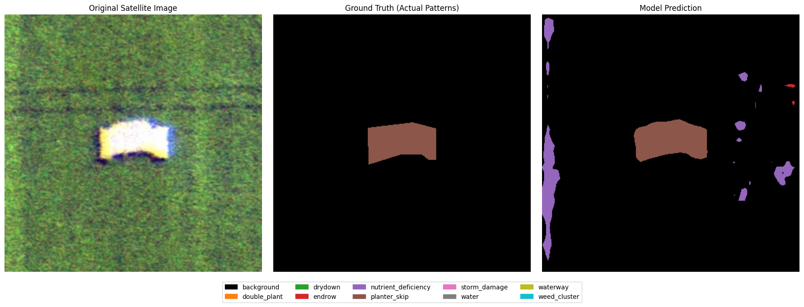
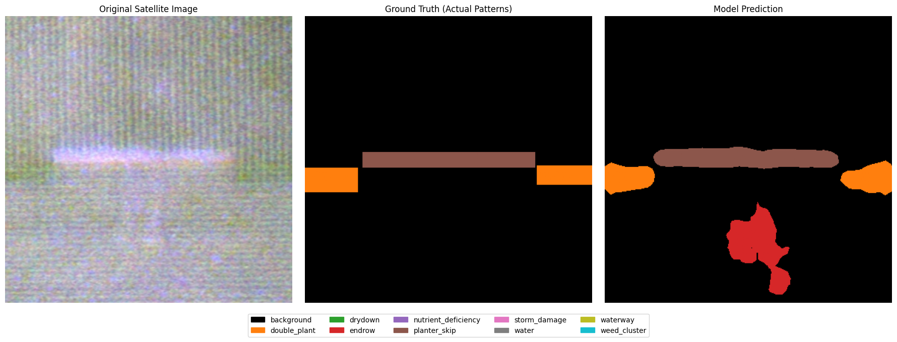
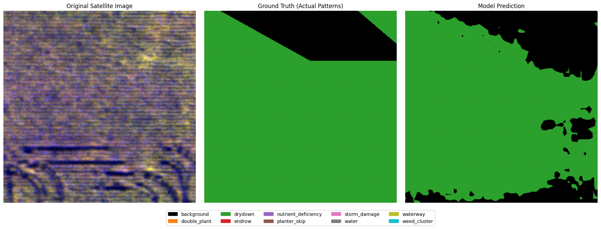

# AI-Powered Farm Anomaly Detection Using Multispectral Semantic Segmentation

A research-oriented deep learning framework for detecting and localizing agricultural anomalies from aerial imagery using RGB and near-infrared (NIR) information.

  

## Abstract

This repository presents a semantic segmentation pipeline for precision agriculture, with the objective of identifying field-level anomalies such as crop stress, structural irregularities, and unusual vegetation patterns from multispectral aerial imagery. The proposed workflow combines RGB and NIR modalities, pretrained segmentation backbones, class-imbalance-aware sampling, and composite loss optimization to produce pixel-level anomaly maps suitable for agricultural monitoring and decision support.

The work is designed as a reproducible experimental framework for researchers and practitioners interested in remote sensing, computer vision, and intelligent crop management systems.

## 1. Motivation and Scientific Context

Modern agriculture increasingly depends on large-scale, data-driven monitoring systems. Manual field inspection remains costly, slow, and often incomplete, especially across large farms or regions with heterogeneous conditions. Semantic segmentation offers a compelling alternative because it enables spatially precise localization of anomalies rather than a coarse image-level label.

This project addresses that need by exploring a deep learning-based segmentation approach tailored to agricultural scenes, where visual evidence of anomalies is often subtle and class distribution is highly imbalanced.

### Why this problem matters

- Early detection of abnormalities can support timely intervention and improved crop health management.
- Pixel-level segmentation provides a more informative representation than simple classification.
- Multispectral information, especially NIR, can reveal patterns that are not easily visible in RGB alone.

## 2. Overview of the Proposed Approach

The repository implements an end-to-end segmentation workflow built around the following core ideas:

1. Multispectral input fusion using RGB and NIR channels.
2. Pixel-wise semantic segmentation for anomaly localization.
3. Rare-class-aware validation strategy to preserve difficult examples during model evaluation.
4. Class-imbalance mitigation through targeted sampling and loss formulation.
5. Pretrained encoder-decoder architectures for robust feature extraction.
6. Qualitative visualization of predictions for interpretability and presentation.

This approach is intended to be both practical and extensible for future research and deployment-oriented agricultural monitoring systems.

## 3. Dataset

The workflow uses the Agriculture-Vision dataset, sourced from Hugging Face.

| Property | Details |
| --- | --- |
| Dataset | Agriculture-Vision (2021) |
| Source | Hugging Face repository: shi-labs/Agriculture-Vision |
| Annotation type | Multi-class segmentation masks |
| Modalities | RGB imagery and NIR imagery |
| Target classes | background, double_plant, drydown, endrow, nutrient_deficiency, planter_skip, storm_damage, water, waterway, weed_cluster |
| Split strategy | Rare-class examples are preserved in validation to improve evaluation coverage |
| Preprocessing | Dynamic cropping/centering and tensor conversion for training |

The dataset is downloaded at runtime and is not bundled directly in the repository.

## 4. Methodology

### 4.1 Multispectral Representation

The model receives a four-channel input tensor consisting of:

- Red channel
- Green channel
- Blue channel
- NIR channel (represented as a grayscale-derived channel)

This fusion enables the network to exploit both visible and non-visible spectral information, which is particularly valuable for agricultural scenes.

### 4.2 Preprocessing and Augmentation

The notebooks implement a preprocessing pipeline that includes:

- Loading RGB and NIR imagery from the dataset structure
- Constructing a four-channel tensor from the available modalities
- Loading label masks and validity masks
- Building multi-class segmentation targets from per-class masks
- Applying augmentation such as random crop, flips, rotation, scaling, brightness/contrast changes, and Gaussian noise
- Normalizing image data to the range $[0,1]$
- Converting samples into PyTorch tensors for training and validation

### 4.3 Segmentation Architecture

The repository explores two segmentation formulations:

- A primary U-Net-based architecture with an EfficientNet-B3 encoder
- An alternative DeepLabV3+ experiment with a ResNet-50 encoder

Both settings use pretrained ImageNet weights and are adapted for four-channel input. The segmentation head predicts a dense class map over the image plane.

### 4.4 Training Strategy

The training setup includes:

- Optimizer: AdamW
- Learning rate: $1 \times 10^{-4}$
- Weight decay: $1 \times 10^{-5}$
- Scheduler: cosine annealing
- Mixed-precision training for improved throughput
- Composite loss combining cross-entropy and Dice loss
- Checkpointing during training and inference export

### 4.5 Handling Class Imbalance

Agricultural anomaly classes are often rare and unevenly distributed. To address this, the pipeline incorporates:

- Rare-class-aware validation splitting
- Sampling strategies intended to preserve underrepresented classes during training and evaluation
- A loss formulation that balances pixel-wise classification and region overlap quality

These choices make the experimental setup more suitable for real-world anomaly detection, where minority classes can be critical.

### 4.6 Evaluation and Interpretation

The notebooks include evaluation logic for:

- Confusion matrices
- Intersection over Union (IoU)
- Mean IoU (mIoU)
- Per-class segmentation performance

The repository also exports prediction masks for inspection and qualitative review.

## 5. Repository Structure

```text
farmland-anomaly-detection/
├── README.md
├── LICENSE
├── PSPNet.ipynb
├── Untitled8.ipynb
├── deeplab-model.ipynb
├── best.pth
├── deep-lab.pth
├── PSPNet.pth
├── val_predictions.zip
├── result1.png
├── result2.png
├── result3.png
├── result4.png
├── result5.png
├── result6.png
├── PSPNet-Results/
└── .gitignore
```

### Key files

- [README.md](README.md): Project overview and documentation
- [Untitled8.ipynb](Untitled8.ipynb): Primary end-to-end segmentation workflow
- [PSPNet.ipynb](PSPNet.ipynb): Exploratory notebook related to the segmentation experiments
- [deeplab-model.ipynb](deeplab-model.ipynb): Alternative DeepLab-based experiment
- [best.pth](best.pth): Primary checkpoint artifact
- [deep-lab.pth](deep-lab.pth): DeepLab experiment checkpoint
- [val_predictions.zip](val_predictions.zip): Exported prediction outputs

## 6. Installation

```bash
git clone https://github.com/kaws26/farmland-anomaly-detection.git
cd farmland-anomaly-detection
python -m venv .venv
source .venv/bin/activate
pip install -q huggingface_hub segmentation-models-pytorch albumentations tqdm
```

## 7. Reproducibility

The workflow is notebook-driven and can be reproduced by opening the relevant notebook and executing the cells in sequence.

### Recommended workflow

1. Open [Untitled8.ipynb](Untitled8.ipynb) for the primary segmentation experiment.
2. Run the cells for dataset download, preprocessing, model creation, training, validation, and inference.
3. Optionally inspect [deeplab-model.ipynb](deeplab-model.ipynb) for the alternative segmentation architecture.
4. Review exported predictions and checkpoint artifacts in the repository root.

## 8. Quantitative Results

The repository contains logged validation metrics for the primary segmentation experiment. The best-performing checkpoint reported during training achieved the following values:

| Model variant | Backbone | Best validation mIoU | Best validation loss | Epoch |
| --- | --- | ---: | ---: | ---: |
| U-Net segmentation model | EfficientNet-B3 | 0.3576 | 0.6562 | 10 |
| DeepLabV3+ segmentation model | ResNet-50 | Not reported in the repository snapshot | — | — |

Based on the available logged metrics, the best model is the U-Net-based configuration with the EfficientNet-B3 encoder, which achieved the highest reported validation mIoU among the documented experiments.

## 9. Qualitative Results

The repository includes several representative prediction visualizations that demonstrate the segmentation workflow.


Additional visual outputs are also available in the [PSPNet-Results](PSPNet-Results) directory.







## 10. Technical Notes

The implementation is intentionally designed as a research prototype rather than a production deployment package. It prioritizes clarity, reproducibility, and experimental flexibility while exposing the core modeling ideas in a compact and accessible form.

The repository is well suited for:

- Academic experimentation
- Computer vision coursework
- Remote sensing and precision agriculture research
- Prototype development for agricultural anomaly monitoring systems

## 11. Citation

If you use this work in academic or research settings, please cite the repository as follows:

```bibtex
@misc{farmland_anomaly_detection_2026,
  title={AI-Powered Farm Anomaly Detection Using Multispectral Semantic Segmentation},
  author={Kawaljeet Singh},
  year={2026},
  howpublished={\url{https://github.com/kaws26/farmland-anomaly-detection}}
}
```

## 12. License

This project is distributed under the MIT License. See [LICENSE](LICENSE) for details.

## 13. Contact

For questions, collaboration, or feedback, please open an issue on the GitHub repository.
