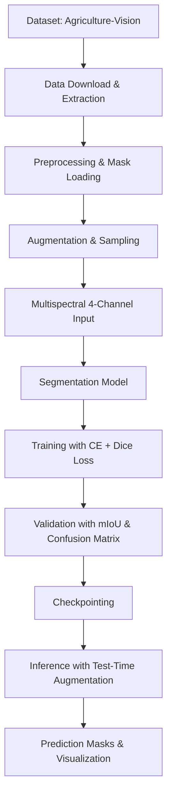
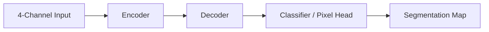
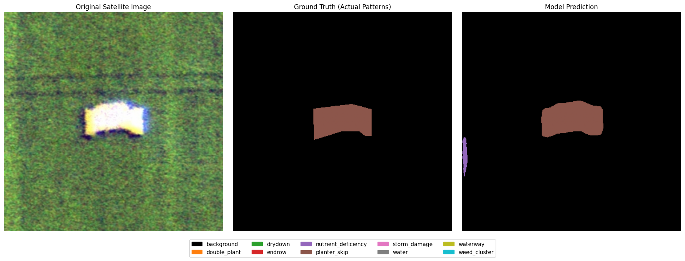
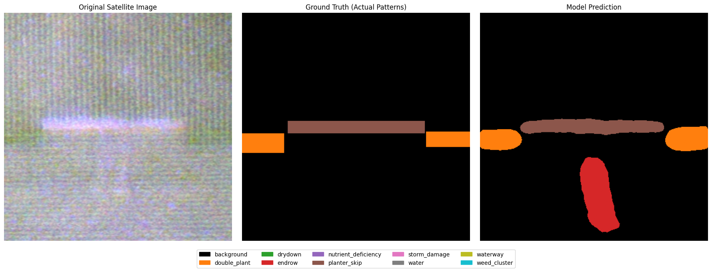
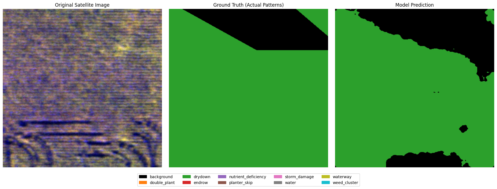

# AI-Powered Farm Anomaly Detection with Multispectral Semantic Segmentation

A research-oriented deep learning workflow for detecting and localizing agricultural anomalies from aerial imagery using RGB and near-infrared (NIR) data.

  

## 1. Overview

This repository implements a semantic segmentation pipeline for farmland anomaly detection. The project addresses the need for scalable, pixel-level identification of field irregularities that are often difficult to detect through manual inspection alone.

The work is motivated by precision agriculture, where early recognition of stress patterns and structural anomalies can support targeted intervention, better crop management, and more efficient field monitoring. The current implementation focuses on multispectral fusion, class imbalance mitigation, and reproducible experimentation through notebooks.

### Why this matters

- Agricultural anomalies can directly impact yield and crop health.
- Manual scouting is labor-intensive and incomplete at scale.
- Pixel-level segmentation provides spatially precise localization rather than coarse classification.

### Target users

- Researchers in remote sensing and precision agriculture
- Machine learning practitioners building segmentation workflows
- Agricultural analytics teams exploring field monitoring systems

## 2. Key Features

The repository implements the following capabilities:

- RGB-NIR multispectral input fusion
- Pixel-wise semantic segmentation
- Rare-class-aware validation splitting
- Class-weighted sampling for imbalance handling
- Composite loss using cross-entropy and Dice loss
- Mixed-precision training
- Test-time augmentation during inference
- Checkpoint saving and prediction export
- Qualitative prediction visualization for presentation and review

## 3. Repository Structure

```text
farmland-anomaly-detection/
├── README.md
├── LICENSE
├── Untitled8.ipynb
├── deeplab-model.ipynb
├── best.pth
├── deep-lab.pth
├── val_predictions.zip
├── result1.png
├── result2.png
├── result3.png
├── result4.png
├── result5.png
├── result6.png
└── .gitignore
```

### What each item contains

- [README.md](README.md): Project overview, usage, and methodology.
- [Untitled8.ipynb](Untitled8.ipynb): Main end-to-end notebook for data loading, model training, validation, and inference.
- [deeplab-model.ipynb](deeplab-model.ipynb): Alternative DeepLab-style experiment.
- [best.pth](best.pth): Checkpoint from the primary workflow.
- [deep-lab.pth](deep-lab.pth): Checkpoint from the DeepLab experiment.
- [val_predictions.zip](val_predictions.zip): Exported validation predictions.
- [result1.png](result1.png) to [result6.png](result6.png): Qualitative segmentation outputs.

## 4. System Architecture



## 5. Dataset

The repository uses the Agriculture-Vision dataset from Hugging Face.

| Property | Details |
| --- | --- |
| Dataset name | Agriculture-Vision (2021) |
| Source | Hugging Face dataset repository: shi-labs/Agriculture-Vision |
| Annotation type | Multi-class segmentation masks |
| Modalities | RGB imagery and NIR imagery |
| Classes used in the notebooks | background, double_plant, drydown, endrow, nutrient_deficiency, planter_skip, storm_damage, water, waterway, weed_cluster |
| Split strategy | Stratified split with rare-class examples forced into validation |
| Training subset used in notebook | 20,000 training files sampled from the available set |
| Validation strategy | Approximately 10% of the sampled set, plus rare-class images preserved for validation |
| Label format | Per-class PNG masks with validity and boundary masks |
| Resolution | Dynamically cropped or centered during preprocessing; no fixed resolution is hard-coded in the repository |

> The repository does not bundle the full dataset locally; it downloads the data at runtime from the Hugging Face source.

## 6. Data Preprocessing

The notebooks implement the following preprocessing and augmentation pipeline:

- Downloading and extracting the Agriculture-Vision archive
- Selecting train and validation directories
- Loading RGB and NIR images
- Constructing a four-channel tensor from RGB + grayscale NIR
- Loading boundary and validity masks
- Building a multi-class label representation from per-class PNG masks
- Applying random crop, horizontal/vertical flip, rotation, and scale/shift transformations
- Applying brightness/contrast adjustment and Gaussian noise
- Normalizing image tensors into the range $[0, 1]$
- Converting images and masks to PyTorch tensors for training

## 7. Model Architecture

The repository contains two segmentation experiments:

### Primary model

- Architecture: U-Net
- Encoder: EfficientNet-B3
- Pretrained weights: ImageNet
- Input channels: 4 (RGB + NIR)
- Output classes: 10 including background

The first convolutional layer is adapted from three input channels to four to support multispectral input.

### Alternative experiment

- Architecture: DeepLabV3+
- Encoder: ResNet-50
- Pretrained weights: ImageNet
- Input channels: 4
- Output classes: 10 including background



## 8. Training Pipeline

The training workflow is implemented in the notebooks and includes:

- Optimizer: AdamW
- Learning rate: $1 \times 10^{-4}$
- Weight decay: $1 \times 10^{-5}$
- Scheduler: Cosine annealing
- Epochs: 12
- Train batch size: 32
- Validation batch size: 4
- Loss: combined cross-entropy and Dice loss
- Mixed precision: enabled with PyTorch AMP and GradScaler
- Checkpointing: saved during training
- Validation: performed every two epochs

## 9. Hyperparameters

| Hyperparameter | Value |
| --- | ---: |
| Epochs | 12 |
| Learning rate | $1 \times 10^{-4}$ |
| Weight decay | $1 \times 10^{-5}$ |
| Train batch size | 32 |
| Validation batch size | 4 |
| Sampling strategy | Weighted random sampling |
| Rare-class validation handling | Forced inclusion of rare examples |
| Mixed precision | Enabled |
| Test-time augmentation | Enabled |

## 10. Evaluation Metrics

The repository implements evaluation using:

- Confusion matrix
- Mean Intersection over Union (mIoU)
- Per-class IoU
- Cross-entropy loss
- Dice loss

No quantitative metric log files or report tables are included in the repository snapshot.

## 11. Experimental Results

The repository includes qualitative outputs and exported predictions, but it does not include saved numeric training logs or benchmark tables.

| Artifact | Availability | Notes |
| --- | --- | --- |
| Qualitative prediction images | Present | Six PNG outputs are included |
| Validation prediction archive | Present | [val_predictions.zip](val_predictions.zip) |
| Model checkpoints | Present | [best.pth](best.pth) and [deep-lab.pth](deep-lab.pth) |
| Training curves | Not available in repository | No TensorBoard or CSV logs were found |
| Numerical metrics | Not available in repository | mIoU and confusion-matrix logic are implemented, but no saved scores are bundled |

## 12. Sample Predictions

The repository already contains several visualization outputs that demonstrate the segmentation workflow.








## 13. Performance Comparison

The repository contains two model variants implemented in the notebooks:

| Model variant | Backbone | Input | Notes |
| --- | --- | --- | --- |
| Main workflow | U-Net + EfficientNet-B3 | 4-channel RGB+NIR | Primary experiment in [Untitled8.ipynb](Untitled8.ipynb) |
| DeepLab experiment | DeepLabV3+ + ResNet-50 | 4-channel RGB+NIR | Alternative experiment in [deeplab-model.ipynb](deeplab-model.ipynb) |

No numerical comparison metrics are included in the repository snapshot.

## 14. Installation

```bash
git clone https://github.com/kaws26/farmland-anomaly-detection.git
cd farmland-anomaly-detection
python -m venv .venv
source .venv/bin/activate
pip install -q huggingface_hub segmentation-models-pytorch albumentations tqdm
```

## 15. Usage

The project is notebook-driven. Open either notebook and run the cells in order.

### Main workflow

- Open [Untitled8.ipynb](Untitled8.ipynb)
- Run the cells for dataset download, preprocessing, model setup, training, validation, and inference

### DeepLab experiment

- Open [deeplab-model.ipynb](deeplab-model.ipynb)
- Run the cells to reproduce the alternative architecture experiment

## 16. Configuration

The notebooks define the main configuration values directly in code, including:

- Class names in the `CLASSES` list
- Number of output classes in `NUM_CLASSES`
- Dataset roots such as `TRAIN_DIR` and `VAL_DIR`
- Batch size and checkpoint directory
- Training and validation transforms

These values are intentionally embedded in the notebook workflow rather than stored in a separate YAML or JSON configuration file.

## 17. Research Contributions

This repository contributes the following elements to the problem of agricultural anomaly segmentation:

- A multispectral segmentation setup that combines RGB and NIR modalities
- A practical rare-class handling strategy through validation preservation and weighted sampling
- A composite loss formulation designed to improve region overlap and pixel-level correctness
- A reproducible notebook-based experimental workflow for research and education
- An exportable inference pipeline for generating segmentation masks

## 18. Limitations

The current repository has several practical limitations:

- The workflow is notebook-centric rather than packaged as a standalone CLI application
- The repository does not include full training logs or published quantitative benchmark tables
- The dataset is downloaded at runtime and is not bundled locally
- The current implementation focuses on experimentation and demonstration rather than deployment integration

## 19. Future Work

Potential next steps include:

- Packaging the workflow into reusable training and inference scripts
- Adding configuration files for reproducible experiments
- Logging metrics to CSV or TensorBoard
- Expanding evaluation with precision, recall, F1, and Dice scores
- Integrating explainability methods such as Grad-CAM or attention visualization
- Extending the pipeline to deployment-oriented inference APIs or web-based dashboards

## 20. Technology Stack

- Python
- PyTorch
- segmentation-models-pytorch
- Albumentations
- OpenCV
- NumPy
- Pandas
- Pillow
- Hugging Face Hub
- Jupyter Notebook

## 21. Dependencies

| Dependency | Purpose |
| --- | --- |
| torch | Model training and inference |
| segmentation-models-pytorch | U-Net and DeepLab-style segmentation architectures |
| albumentations | Data augmentation |
| huggingface_hub | Dataset download from Hugging Face |
| tqdm | Progress bars |
| numpy | Array manipulation and mask processing |
| pandas | Lightweight data handling in notebooks |
| pillow | Image loading and saving |
| opencv-python | Image-processing utilities |

## 22. Reproducibility

To reproduce the workflow:

1. Install the dependencies listed above.
2. Open [Untitled8.ipynb](Untitled8.ipynb) or [deeplab-model.ipynb](deeplab-model.ipynb).
3. Run the cells in order.
4. Use the same random seed values provided in the notebooks for the split and sampling logic.
5. Inspect the generated checkpoints and exported predictions.

## 23. Citation

```bibtex
@misc{farmland_anomaly_detection_2026,
  title={AI-Powered Farm Anomaly Detection with Multispectral Semantic Segmentation},
  author={Kawaljeet Singh},
  year={2026},
  howpublished={\url{https://github.com/kaws26/farmland-anomaly-detection}}
}
```

## 24. License

This project is distributed under the MIT License. See [LICENSE](LICENSE) for details.

## 25. Acknowledgements

This project builds on the following open resources:

- Agriculture-Vision benchmark dataset
- Hugging Face Hub dataset hosting
- PyTorch and segmentation-models-pytorch
- Albumentations for augmentation
- The broader open-source computer vision and remote sensing community

## 26. Contact

For questions, collaboration, or feedback, please open an issue on the GitHub repository.

